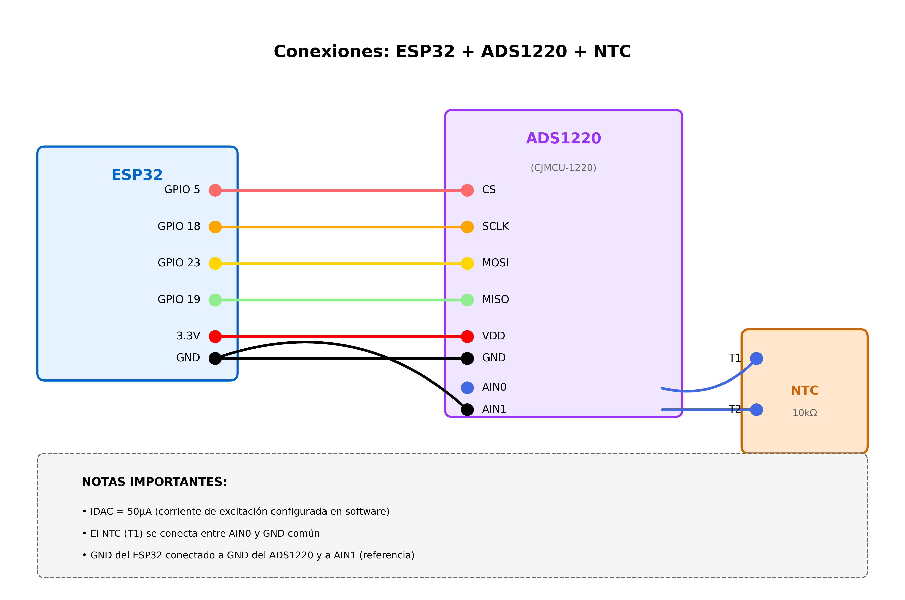

# Simple NTC Reading Example

## Descripción
Este ejemplo demuestra la lectura básica de temperatura usando un termistor NTC con el ADS1220.

## Características
- Lectura directa de temperatura sin filtro
- Lectura filtrada con media móvil (10 muestras)
- Muestra voltaje y resistencia del NTC
- Usa coeficientes Steinhart-Hart predeterminados

## Hardware Requerido
- ESP32
- Módulo CJMCU-1220 (ADS1220)
- Termistor NTC 10kΩ @ 25°C (ej: Measurement Specialties)

## Conexiones

### ESP32 → ADS1220
```
GPIO 5  → CS
GPIO 18 → SCLK
GPIO 23 → MOSI
GPIO 19 → MISO
3.3V    → VDD
GND     → GND
```

### NTC → ADS1220
```
Terminal 1 del NTC → AIN0
Terminal 2 del NTC → GND (común con AIN1)
```

**Nota:** AIN1 también se conecta a GND para establecer la referencia.

## Diagrama de Conexión


## Configuración

### Corriente IDAC
La corriente predeterminada es 50µA. Ajusta según tu NTC:
```cpp
#define IDAC_CURRENT_UA  50.0f  // µA
```

**Recomendaciones:**
- NTC 1kΩ:   50-100 µA
- NTC 10kΩ:  100-250 µA
- NTC 100kΩ: 10-50 µA

### Coeficientes Steinhart-Hart
Si tienes los coeficientes específicos de tu NTC, modifícalos en setup():
```cpp
ntcSensor.setNTCCoefficients(CHANNEL_0, A, B, C);
```

### Filtro de Media Móvil
Ajusta el tamaño del filtro según necesites:
```cpp
ntcSensor.setMovingAverageSize(10);  // 1-20 muestras
```

## Salida Esperada
```
========================================
Tiempo: 1.0 s
========================================
Voltaje:           2.453 mV
Resistencia:       9.812 kΩ
Temp (sin filtro): 25.34 °C
Temp (filtrada):   25.32 °C
Diferencia:        0.02 °C
========================================
```

## Troubleshooting

### Error: No se pudo inicializar el ADS1220
- Verifica las conexiones SPI
- Confirma que el módulo tiene 3.3V
- Verifica el pin CS (debe ser GPIO 5)

### Lecturas Ruidosas
- Aumenta el tamaño del filtro: `setMovingAverageSize(15)`
- Verifica conexiones del NTC
- Reduce la corriente IDAC si hay auto-calentamiento

### Temperatura Incorrecta
- Verifica los coeficientes Steinhart-Hart
- Comprueba que el NTC sea de 10kΩ @ 25°C
- Ajusta la corriente IDAC
