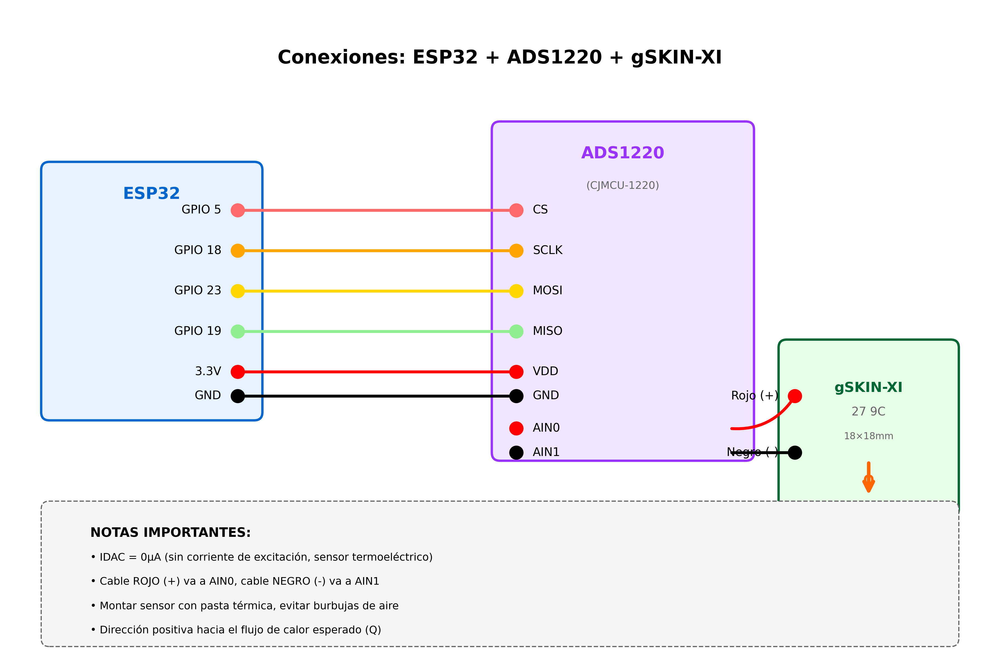

# gSKIN Heat Flux Sensor Example

## Descripción
Este ejemplo demuestra cómo usar sensores de flujo térmico gSKIN-XI con el ADS1220 para medir flujo de calor y potencia térmica.

## Características
- Lectura de voltaje termoeléctrico directo
- Cálculo de flujo térmico (W/m²)
- Cálculo de potencia térmica total (W)
- Corrección de sensibilidad por temperatura
- Filtro de media móvil para lecturas estables

## Hardware Requerido
- ESP32
- Módulo CJMCU-1220 (ADS1220) para sensor gSKIN
- Sensor gSKIN-XI 27 9C (18mm x 18mm)
- (Opcional) Segundo ADS1220 + NTC para medir temperatura del sensor

## Conexiones

### ESP32 → ADS1220
```
GPIO 5  → CS
GPIO 18 → SCLK
GPIO 23 → MOSI
GPIO 19 → MISO
3.3V    → VDD
GND     → GND
```

### gSKIN-XI → ADS1220
```
Cable ROJO (+)  → AIN0
Cable NEGRO (-) → AIN1
```

**IMPORTANTE:** 
- Montar el sensor con pasta térmica de calidad
- El lado positivo debe apuntar hacia la dirección del flujo de calor esperado
- Evitar burbujas de aire entre el sensor y la superficie

## Diagrama de Conexión


## Configuración

### Calibración del Sensor
Cada sensor gSKIN incluye un certificado de calibración. Usa tus valores específicos:

```cpp
#define GSKIN_SO        54.3f        // µV/(W/m²) @ To
#define GSKIN_SC        0.0697f      // (µV/(W/m²))/°C
#define GSKIN_TO        22.5f        // °C
#define GSKIN_AREA      0.000324f    // m² (18mm x 18mm)
```

**Dónde encontrar estos valores:**
- Certificado de calibración del sensor
- Datasheet del modelo específico

### Corrección de Temperatura
Para máxima precisión, mide la temperatura del sensor:
```cpp
// TODO: Implementar lectura desde segundo ADS1220 con NTC
sensorTemperature = leerTemperaturaNTC();
```

Sin medición de temperatura, usa estimación (menor precisión):
```cpp
sensorTemperature = 25.0f;  // °C (temperatura ambiente estimada)
```

## Interpretación de Resultados

### Voltaje
El voltaje termoeléctrico generado por el sensor:
- Voltaje positivo = flujo de calor hacia arriba (+)
- Voltaje negativo = flujo de calor hacia abajo (-)
- Voltaje cercano a 0 = sin flujo térmico significativo

### Flujo Térmico (W/m²)
Densidad de flujo de calor por área:
- Positivo: calor fluyendo en dirección positiva del sensor
- Negativo: calor fluyendo en dirección contraria
- Magnitud típica: 0-100 W/m² para aplicaciones comunes

### Potencia Térmica (W)
Potencia total a través del área del sensor:
```
Potencia (mW) = Flujo (W/m²) × Área (m²) × 1000
```

Para gSKIN-XI 27 9C (324 mm²):
- 10 W/m² = 3.24 mW
- 50 W/m² = 16.2 mW
- 100 W/m² = 32.4 mW

## Salida Esperada
```
========================================
Timestamp: 1.000 s
========================================
Temperatura sensor: 25.00 °C
Voltaje: 543.210 µV
Sensibilidad corregida: 54.4745 µV/(W/m²)
Flujo térmico: 9.971 W/m²
Flujo filtrado: 9.968 W/m²
Potencia térmica: 3.231 mW

Estado: Flujo térmico POSITIVO (calor hacia arriba)
========================================
```

## Fórmulas de Cálculo

### Sensibilidad Corregida
```
S = So + (Ts - To) × Sc
```
Donde:
- S = Sensibilidad corregida [µV/(W/m²)]
- So = Sensibilidad @ calibración [µV/(W/m²)]
- Ts = Temperatura del sensor [°C]
- To = Temperatura de calibración [°C]
- Sc = Coeficiente de temperatura [(µV/(W/m²))/°C]

### Flujo Térmico
```
φ = U / S
```
Donde:
- φ = Flujo térmico [W/m²]
- U = Voltaje medido [µV]
- S = Sensibilidad corregida [µV/(W/m²)]

### Potencia Térmica
```
Φ = A × φ
```
Donde:
- Φ = Potencia térmica [W]
- A = Área del sensor [m²]
- φ = Flujo térmico [W/m²]

## Precisión

### Con Corrección de Temperatura
- ±3% en rango -30°C a 70°C
- ±5% a ±10% fuera del rango de calibración

### Sin Corrección de Temperatura
- ±3% @ 22.5°C (To)
- Error adicional ~2.2% @ 40°C
- Error adicional ~5% @ 60°C

## Troubleshooting

### Flujo Térmico Siempre Cero
- Verifica que exista un gradiente de temperatura real
- Confirma que el sensor esté bien montado con pasta térmica
- Verifica el modo: debe ser `MODE_HEAT_FLUX`

### Lecturas Ruidosas
- Aumenta el tamaño del filtro: `setMovingAverageSize(15)`
- Mejora el montaje del sensor (elimina burbujas de aire)
- Usa cable apantallado para el sensor

### Lecturas Inconsistentes
- Verifica la calibración (So, Sc, To, área)
- Confirma que el sensor esté montado en la dirección correcta
- Implementa medición de temperatura del sensor para corrección precisa

### Error de Polaridad
Si las lecturas tienen signo invertido:
- Intercambia las conexiones AIN0 ↔ AIN1
- O invierte la dirección del sensor físicamente
